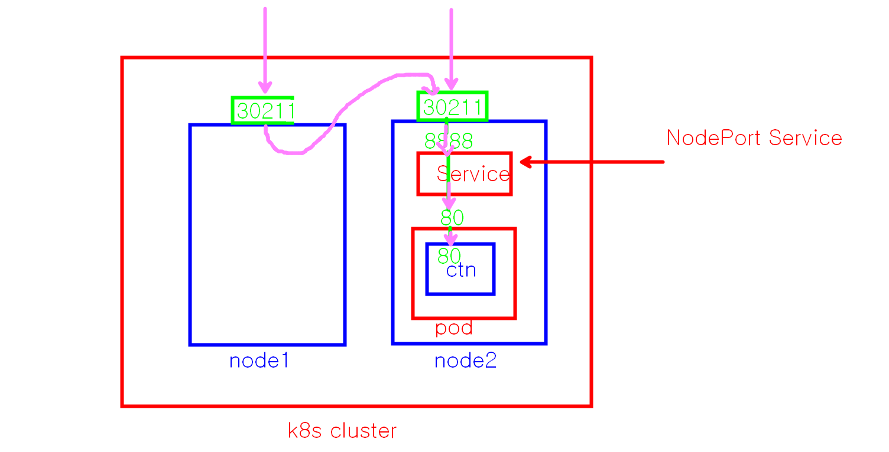
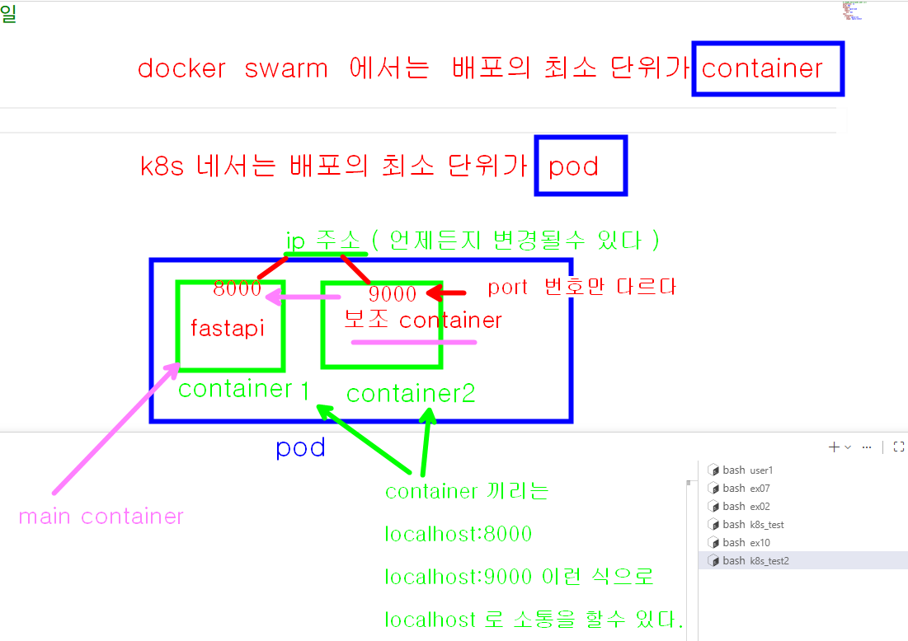
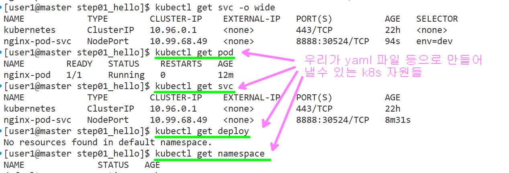

# memo.md





```bash

# pod1.yaml 문서를 클러스터에 적용하기
kubectl  apply  -f  <파일명>
kubectl  apply  -f  pod1.yaml 

# 현재 실행중인 pod 목록 검색
kubectl get pod
# 현재 실행중인 pod 목록을 좀더 자세히 검색
kubectl get pod -o wide
# pod 의 ip 주소를 확인해서 curl 로 요청해보기
curl 192.168.104.25

# host 의 8888 port 를 pod 의 80 port 로 연결해주는 NodePort 서비스 만들기
# 노출되는 node 의 port 는 30000 ~ 32767 사이에서 랜덤하게 배정이 된다.  
kubectl expose pod nginx-pod --type=NodePort --name=nginx-pod-svc --port=8888 --target-port=80 \
    --labels="color=blue"

# 실행중인 서비스 목록 검색
kubectl get svc

# 실행중인 서비스 목록 자세히 검색
kubectl get svc -o wide

# kubectl get svc 해서 배정된 port 번호를 확인한 다음 
kubectl get svc
NAME            TYPE        CLUSTER-IP     EXTERNAL-IP   PORT(S)          AGE
kubernetes      ClusterIP   10.96.0.1      <none>        443/TCP          80m
nginx-pod-svc   NodePort    10.100.21.95   <none>        8888:30211/TCP   95s

# 모든 node 에 대해서 실행해 본다. 
http://172.16.8.10:30211
http://172.16.8.11:30211
http://172.16.8.12:30211


# pod 삭제하기
kubectl delete  pod  <파드명>
# pod 삭제하기 방법2
kubectl delete -f  <yaml 파일명>

# svc 삭제하기
kubectl delete svc  <service 명>
kubectl delete -f <yaml 파일명>

# 실습후에 vmware 를 끌때

master node 를 먼저 끄고 ->  node1, node2 를 끈다

# 다시 vmware 를 켤때

node1, node2 를 먼저 켜고 -> master node 를 킨다 
```