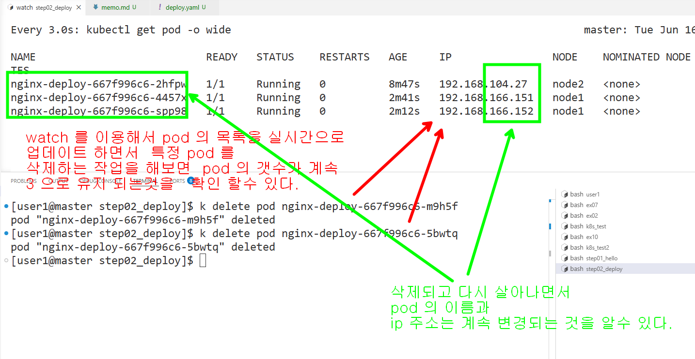

```bash

# deploy.yaml 적용하기 
k apply -f deploy.yaml

# pod 확인
k get pod
# deploy 확인
k get deploy

# 새로운 보조 터미날을 열어서 3초마다  pod 를 감지하는 프로세스 시작
watch -n 3 "kubectl get pod -o wide"

# deploy 제거
k delete -f deploy.yaml

# httpd:alpine 이라는 이미지를 이용해서  deploy2.yaml 문서를 만들어서 pod 를 2 개 띄워 보세요.
# httpd 는 apache 웹서버 이미지 입니다

# deploy2.yaml 파일 적용
k apply -f deploy2.yaml 
# deploy2.yaml 파일로 적용한것을 삭제 
k delete -f deploy2.yaml

# 현재 경로에 있는 모든 yaml 파일을 읽어서 적용하겠다
k apply -f  .
# 현재 경로에 있는 모든 yaml 파일로 적용한것을 삭제 하겠다.
k delete -f .

```

### 특정 pod 를 삭제하는 실습해 보기 

