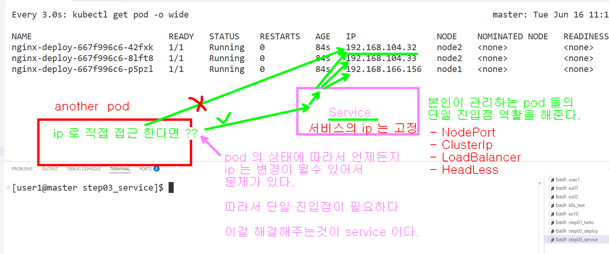
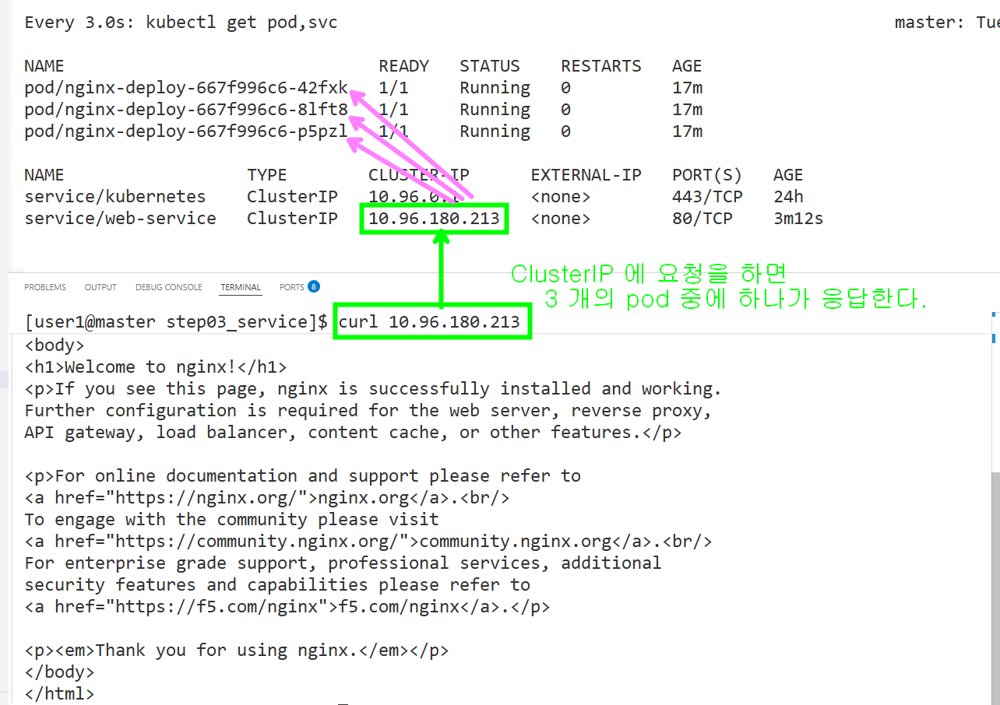

```bash
# ClusterIP 서비스를 시작 시킨다
k apply -f service.yaml

# 서비스의 ip 주소를 확인해서 요청을 보내 본다.
curl 10.96.180.213 

# pod 의 갯수를 변경시켜 본다
k scale deployment nginx-deploy --replicas=1

# 서비스의 ip 주소를 확인해서 요청을 보내 본다.
curl 10.96.180.213 

# pod 의 갯수를 변경시켜 본다
k scale deployment nginx-deploy --replicas=5

# 서비스의 ip 주소를 확인해서 요청을 보내 본다.
curl 10.96.180.213 
```

