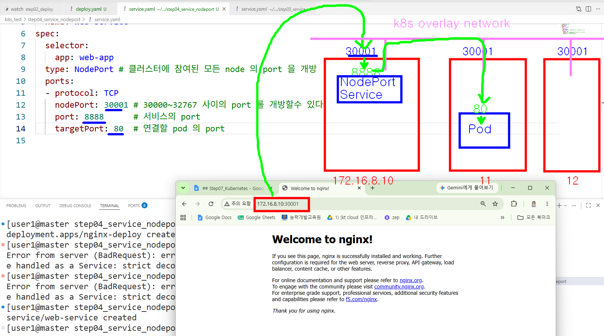
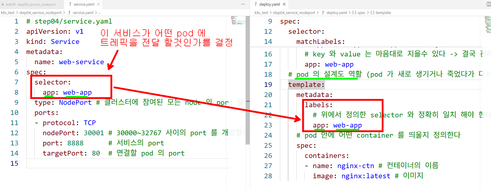
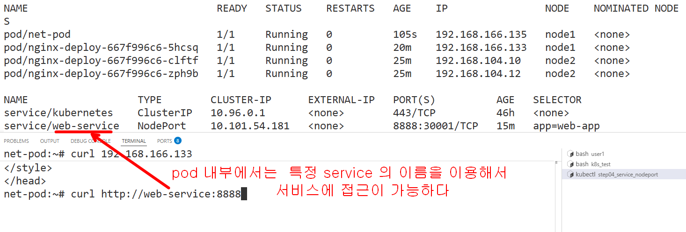

```bash

k apply -f deploy.yaml
k apply -f service.yaml

```

### 외부 (window) 에서 webbrower 를 열어서  http://172.16.8.10:30001 로 요청해 보기
#### http://172.16.8.10:30001 , http://172.16.8.11:30001, http://172.16.8.12:30001 모두다 가능



```bash
# debug 용 pod 를 하나 띄워서 해당 pod 안에서 서비스 접근해 보기
# nicolaka/netshoot 는 network 에 관련된 여러가지 테스트를 할수 있는 이미지 
kubectl run net-pod -it --rm --image=nicolaka/netshoot --restart=Never -- /bin/bash

```

#### pod 내부에서는 service 의 이름으로도 접근이 가능하다


```bash
# 실습후 마무리
k delete -f .
```