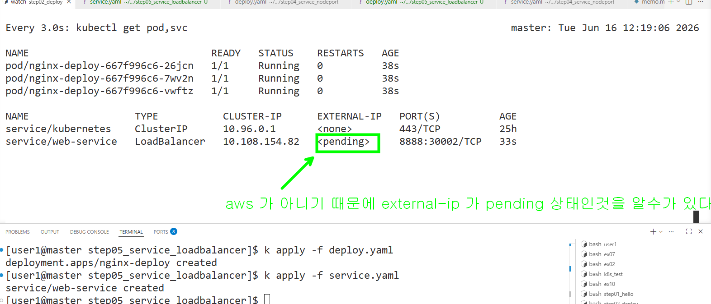

```yml
spec:
  selector:
    app: web-app
  type: LoadBalancer # 원래는 클라우드 제공자에서 로드벨런서를 프로비저닝 하는 type
  ports:
  - protocol: TCP
    nodePort: 30002
    port: 8888
    targetPort: 80
  externalIPs:    # 클라우드 로드벨런서 외에 명시적으로 트레픽을 수신할 외부 고정 ip 지정
    - 172.16.8.20
```

### externalIPs 를 추가 하고 나면 EXTERNAL-IP 가 배정되는걸 알수가 있다.