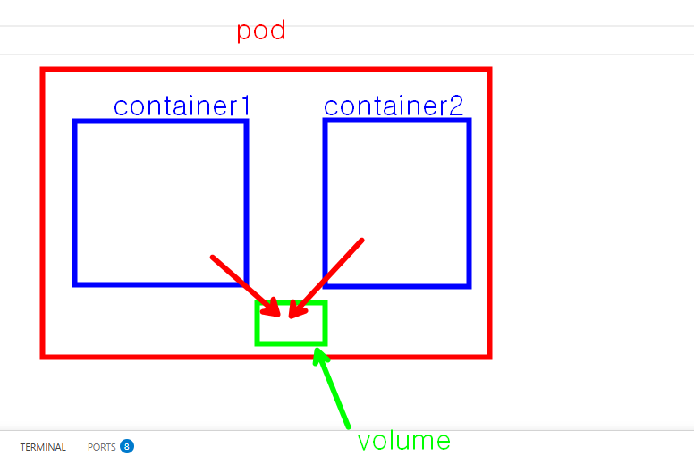
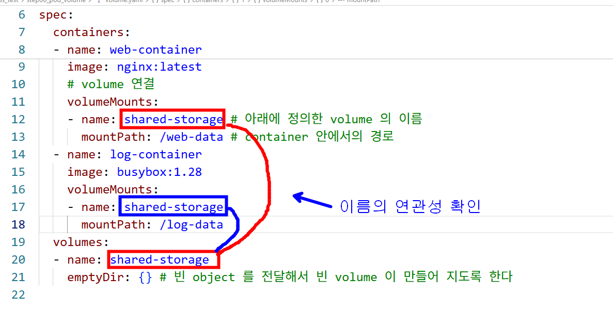
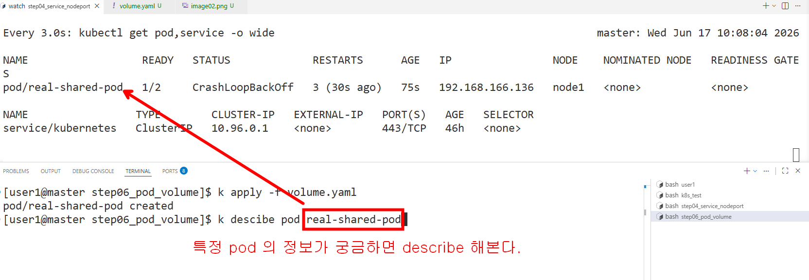
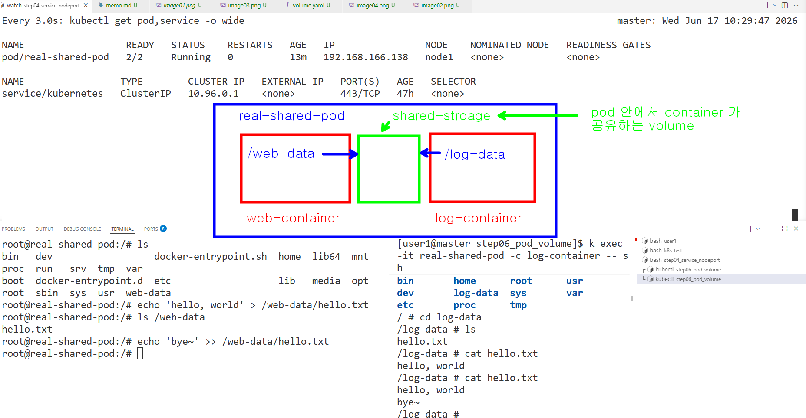

### pod 안에 특정 container 로 접속해서 작업하기

```bash

# pod 안에 container 가 여러개인 경우에는  -c <container 이름>  옵션을 추가해서 접속한다 
# web-container 로 접속
k exec -it real-shared-pod -c web-container -- /bin/bash

# web-container 안에서 실행하기
echo 'hello, world' > /web-data/hello.txt

# log-container 로 접속 (busybox 는 /bin/bash 가 없어서 가벼운 sh 를 실행)
# k exec -it real-shared-pod -c log-container -- /bin/bash
k exec -it real-shared-pod -c log-container -- sh

# log-container 안에서 실행
ls
cd log-data
# hello.txt 파일이 존재한다 
ls
# web-container 안에서 만든 파일의 내용을 확인 할수 있다.
cat hello.txt

```


<hr>

<hr>

<hr>

<hr>
