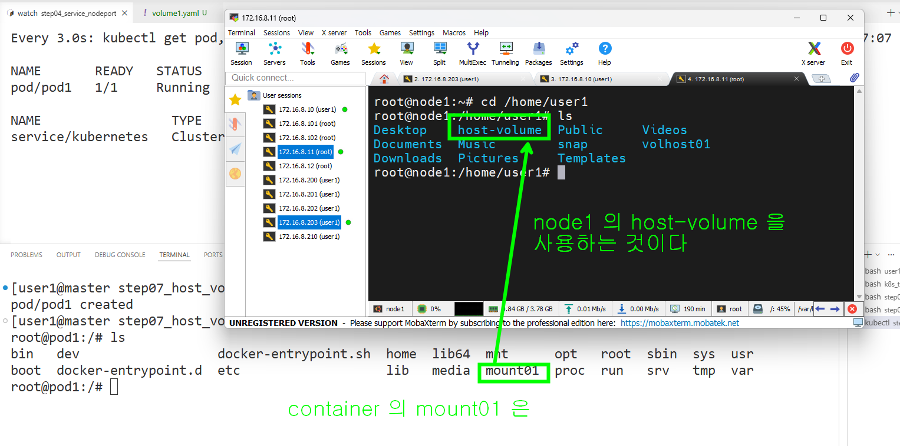

### 특정 host 의 폴더를 volume 으로 사용하는 예제

```bash
# pod 배포
k apply -f volume1.yaml

# pod 에 직접 들어가지 않고 접속만 해서 명령어 실행
kubectl exec -it pod1 -- sh -c "echo 'Hello from pod' > /mount01/hello.txt"
kubectl exec -it pod1 -- cat /mount01/hello.txt

```
#### node1 에 접속해서 확인하기


```bash
# pod 삭제 후에 다시 실행하기
k delete -f volume1.yaml

# 위에서 만들었는 파일의 내용을 확인해 볼수 있다
kubectl exec -it pod1 -- cat /mount01/hello.txt

```