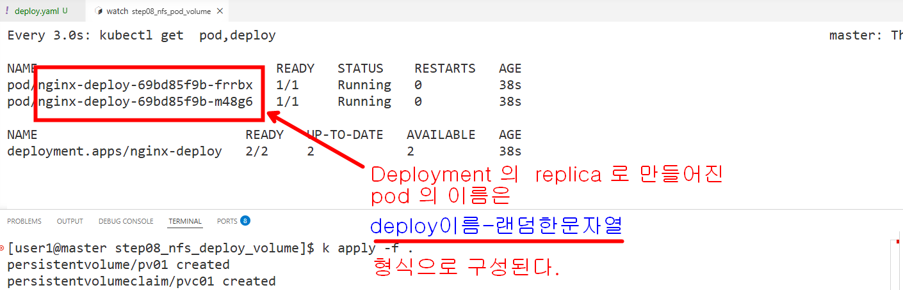

### pod 를 여러개 띄울건데, 다 같이 하나의 폴더(nfs) 를 공유하면서 읽고 쓰게 만들고 싶다면 지금 예제 처럼 만들면된다.

```bash
# 파드의 이름을 검색해서 
k get pod

# 파드의 이름이 "deploy이름-랜덤한문자열" 임을 확인한다

# 파드의 이름을 복사해서 아래를 실행
k exec -it <pod 이름1> -- sh -c "echo 'hello from pod1' >> /mount01/message.txt"
k exec -it nginx-deploy-69bd85f9b-bg56b -- sh -c "echo 'hello from pod1' >> /mount01/message.txt"

kubectl exec -it <pod 이름1> -- cat /mount01/message.txt
kubectl exec -it nginx-deploy-69bd85f9b-bg56b -- cat /mount01/message.txt

kubectl exec -it <pod 이름2> -- cat /mount01/message.txt
kubectl exec -it nginx-deploy-69bd85f9b-m48g6 -- cat /mount01/message.txt

k exec -it <pod 이름2> -- sh -c "echo 'hello from pod2' >> /mount01/message.txt"
k exec -it nginx-deploy-69bd85f9b-m48g6 -- sh -c "echo 'hello from pod2' >> /mount01/message.txt"

kubectl exec -it <pod 이름1> -- cat /mount01/message.txt
kubectl exec -it nginx-deploy-69bd85f9b-bg56b -- cat /mount01/message.txt

```

