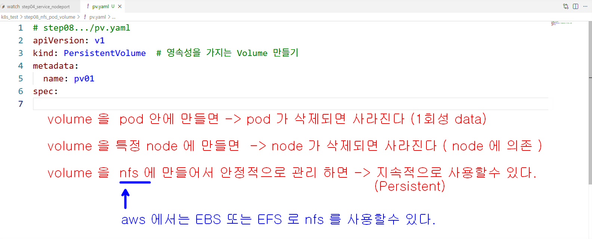
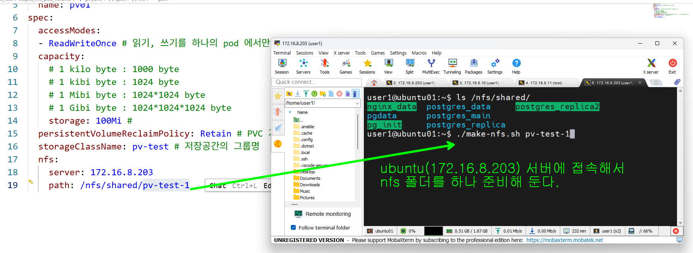
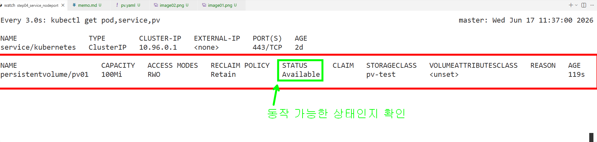
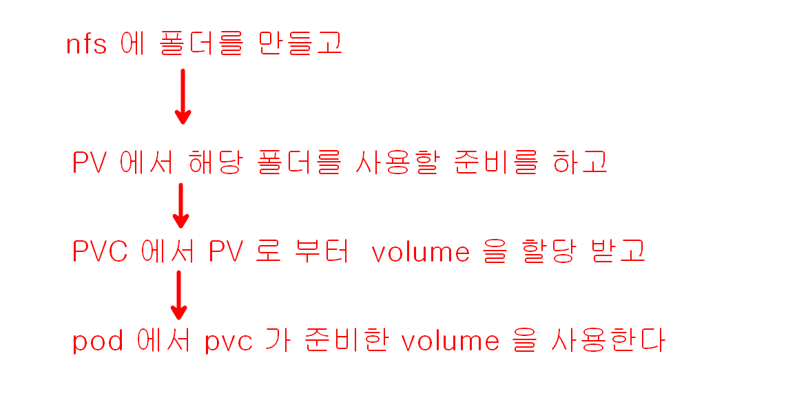
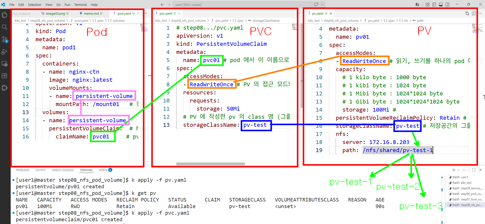
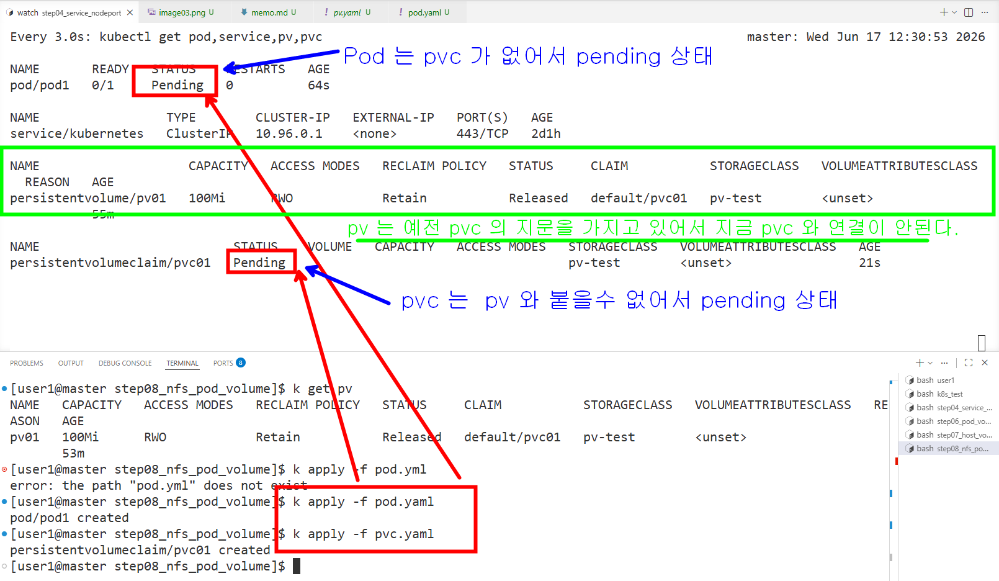
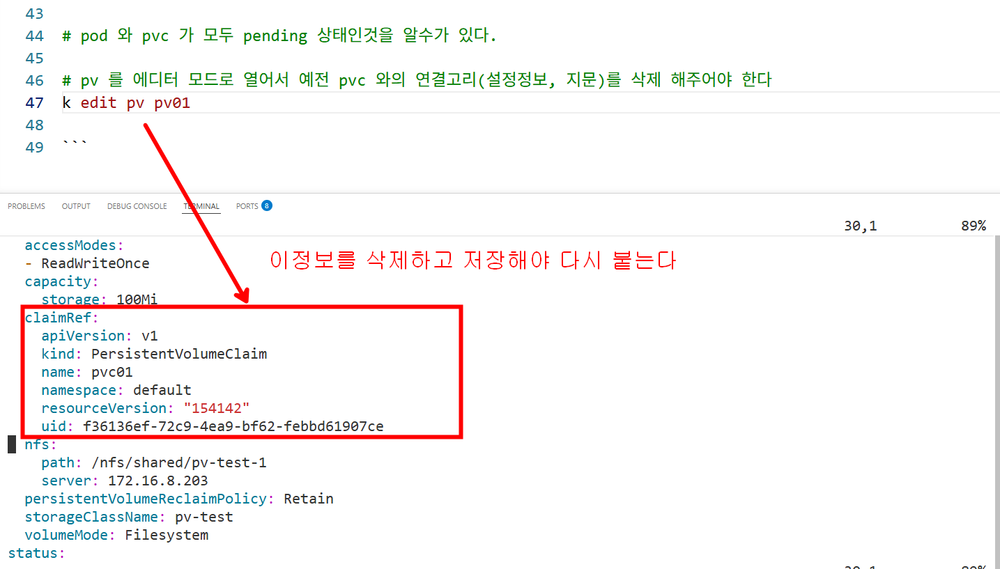
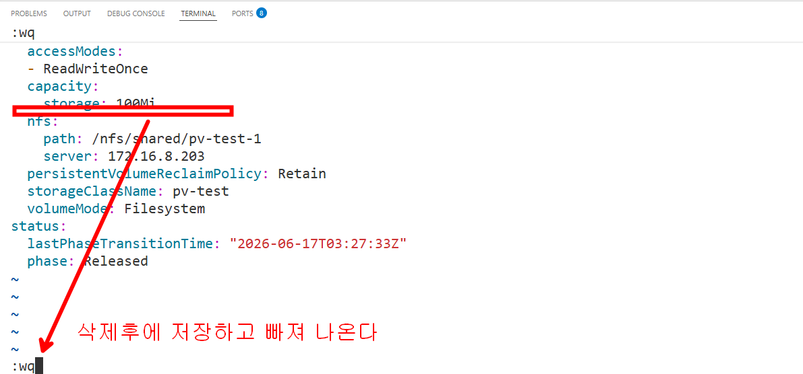
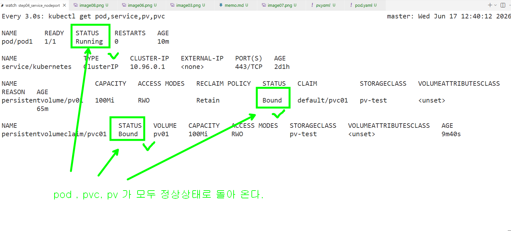

### nfs 볼륨 사용해 보기







```bash
# 모든 노드에 nfs 클라이언트를 설치한다 (k8s 의 PV 가 사용할 예정)
sudo apt-get update && sudo apt-get install -y nfs-common

# pv 를 적용한다
k apply -f pv.yaml
# 결과 확인
k get pv

k apply -f pvc.yaml

k apply -f pod.yaml

# pod1 에 접속해서 hello.txt 파일을 만든다 
kubectl exec -it pod1 -- sh -c "echo 'Hello from pod1' > /mount01/hello.txt"
# 내용확인
kubectl exec -it pod1 -- cat /mount01/hello.txt

# nfs 서버에서도 확인
ssh user1@172.16.8.203 "ls -al /nfs/shared/pv-test-1"

# pod 만 삭제후에
k delete -f pod.yaml

# 다시 배포해서 
k apply -f pod.yaml

# 동일한 pv 를 사용하는지 확인
kubectl exec -it pod1 -- cat /mount01/hello.txt

# 이번에는  pod 와 pvc 를 삭제해 보자
k delete -f pod.yaml
k delete -f pvc.yaml
# pv 는 Released 된 상태로 남아 있는 것을 확인한다 
k get pv 

# 다시 pod 와 pvc 를 배포 해보자
k apply -f pod.yaml
k apply -f pvc.yaml

# pod 와 pvc 가 모두 pending 상태인것을 알수가 있다.

# pv 를 에디터 모드로 열어서 예전 pvc 와의 연결고리(설정정보, 지문)를 삭제 해주어야 한다 
k edit pv pv01 

```



