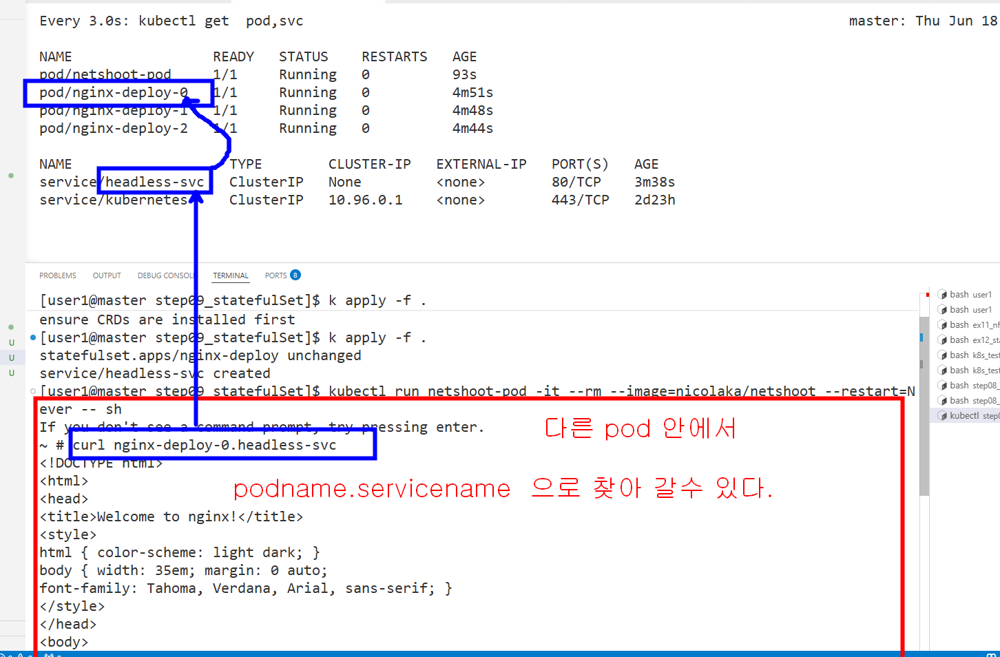
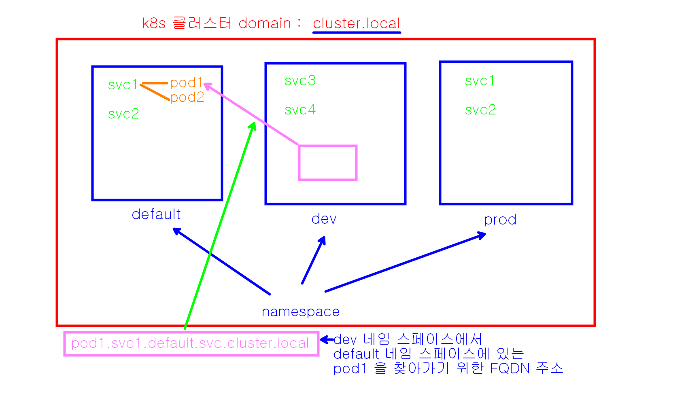
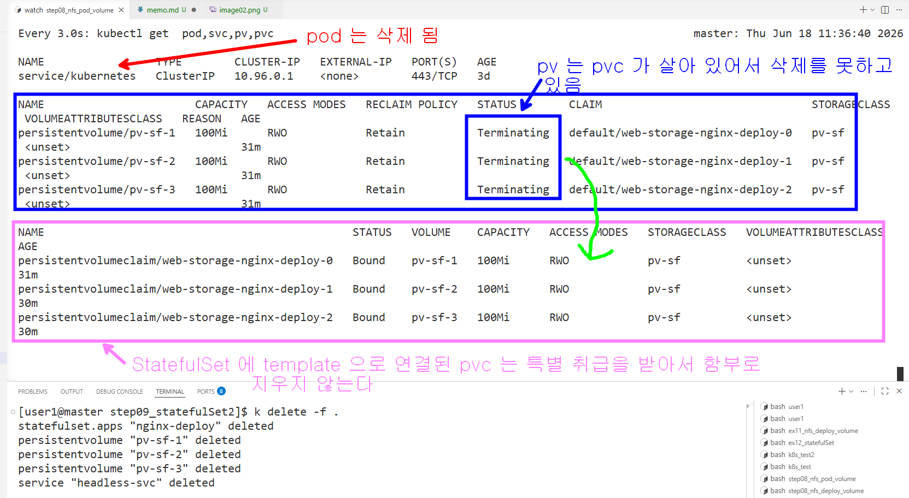

```bash
watch -n 3 "kubectl get pod,service,pv,pvc"

k apply -f .

# 0번 파드 금고에 글씨 쓰기
kubectl exec nginx-deploy-0 -- sh -c "echo '<h1>여기는 0번방 (Master DB 대기실)</h1>' > /usr/share/nginx/html/index.html"

# 1번 파드 금고에 글씨 쓰기
kubectl exec nginx-deploy-1 -- sh -c "echo '<h1>여기는 1번방 (Slave-A)</h1>' > /usr/share/nginx/html/index.html"

# 2번 파드 금고에 글씨 쓰기
kubectl exec nginx-deploy-2 -- sh -c "echo '<h1>여기는 2번방 (Slave-B)</h1>' > /usr/share/nginx/html/index.html"

# 테스트 pod 를 실행해서 아래의 curl 을 테스트한다
kubectl run netshoot-pod -it --rm --image=nicolaka/netshoot --restart=Never -- sh

# 테스트 파드 안에서 각각 테스트 
curl nginx-deploy-0.headless-svc
curl nginx-deploy-1.headless-svc
curl nginx-deploy-2.headless-svc

# 파드를 하나 강제로 없애보자
k delete pod nginx-deploy-0
# 테스트 파드 안에서 되살아난 pod 에 다시 요청해도 동일한 결과가 나온다. 
curl nginx-deploy-0.headless-svc

# 다른 네임스페이스를 하나 추가로 만들어본다.
k create namespace test-ns
# 추가한 후에 네임스페이스 목록 확인
k get ns


# 테스트 pod 를 test-ns 라는 네임 스페이스에서 실행해서 아래의 curl 을 테스트한다
kubectl run netshoot-pod -it --rm --image=nicolaka/netshoot --restart=Never -n test-ns -- sh

# 다른 네임 스페이스(test-ns) 에서 실행중인 pod 안에서 실행하면 접근이 안된다. (동일 네임스페이스에서만 가능)
curl nginx-deploy-0.headless-svc
curl nginx-deploy-1.headless-svc
curl nginx-deploy-2.headless-svc
```


```bash
# 만일 접근하자고 하는 서비스가 다른 네임스페이스에 있으면 full domain name 을 다 적어야한다 
curl nginx-deploy-0.headless-svc.default.svc.cluster.local
curl nginx-deploy-1.headless-svc.default.svc.cluster.local
curl nginx-deploy-2.headless-svc.default.svc.cluster.local

# 테스트 네임스페이스 삭제
k delete ns test-ns

# 전체 배포를 삭제해 보자
k delete -f . 

# 삭제해도 pvc 는 여전히 남아 있다
```



```bash

# 다시 배포하면 이전 상태와 동일하게 살아난다
k apply -f .

# 모두 파괴 하고 싶으면 아래를 입력하고
k delete -f .

# Terminitaing 되어 있는 pv 를 하나씩 에디터 모드로 열어서 아래의 claimRef 문서부분을 찾아서 삭제하면 풀린다(dd)
k edit pv pv-sf-1
k edit pv pv-sf-2
k edit pv pv-sf-3  
```

```yml
  # 이부분을 통째로 삭제하고 저장 
  claimRef:
    apiVersion: v1
    kind: PersistentVolumeClaim
    name: pvc01
    namespace: default
    resourceVersion: "108760"
    uid: fdfa03ce-d9b4-4978-af1b-2df20ed01774
```

```bash
# 모든 pvc 삭제하기
k delete pvc --all
```