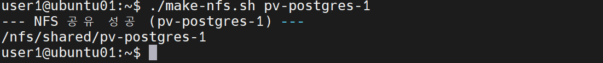
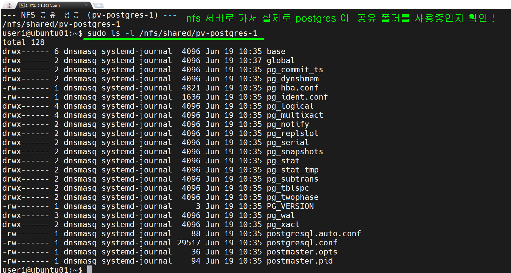
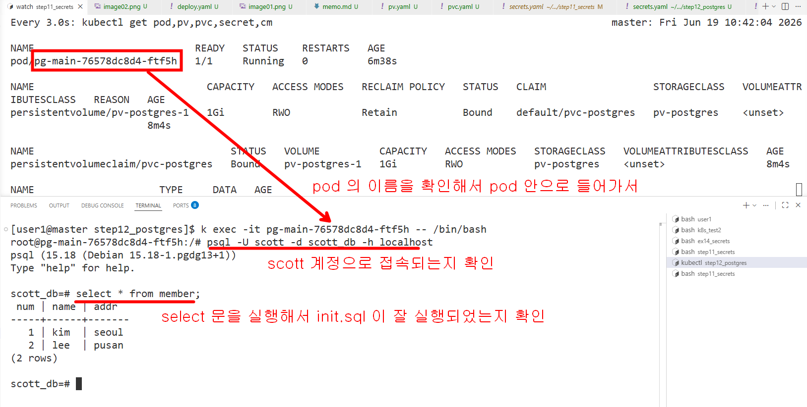
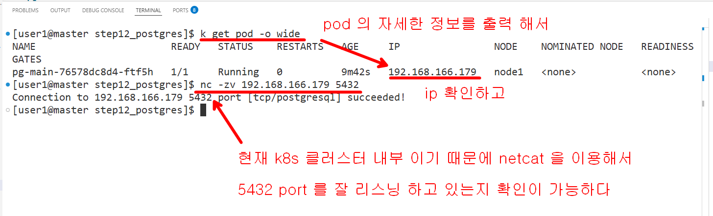
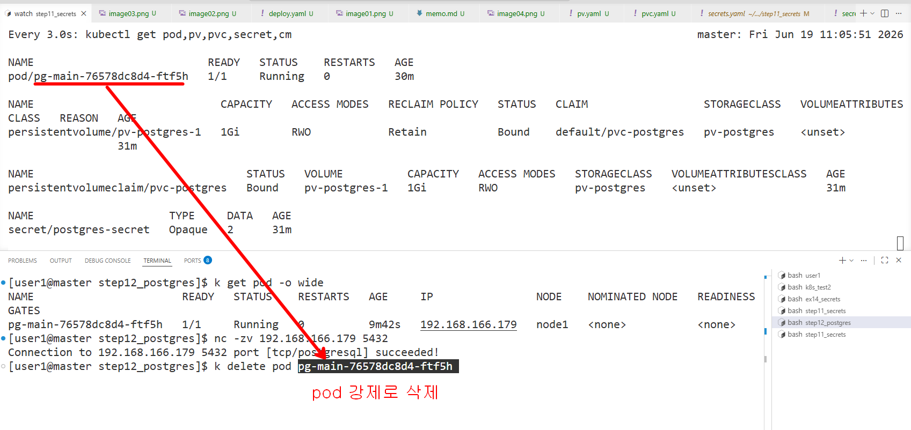
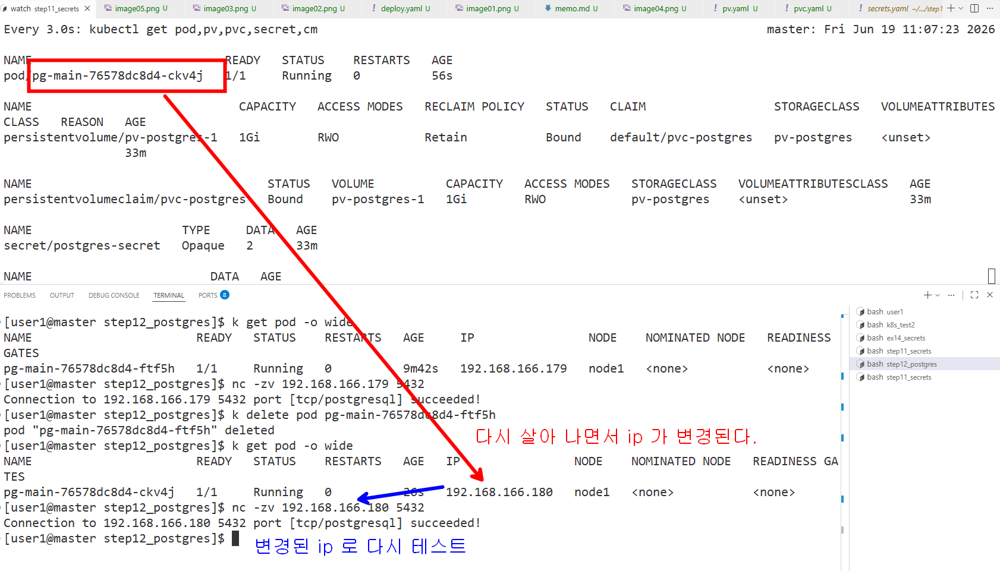
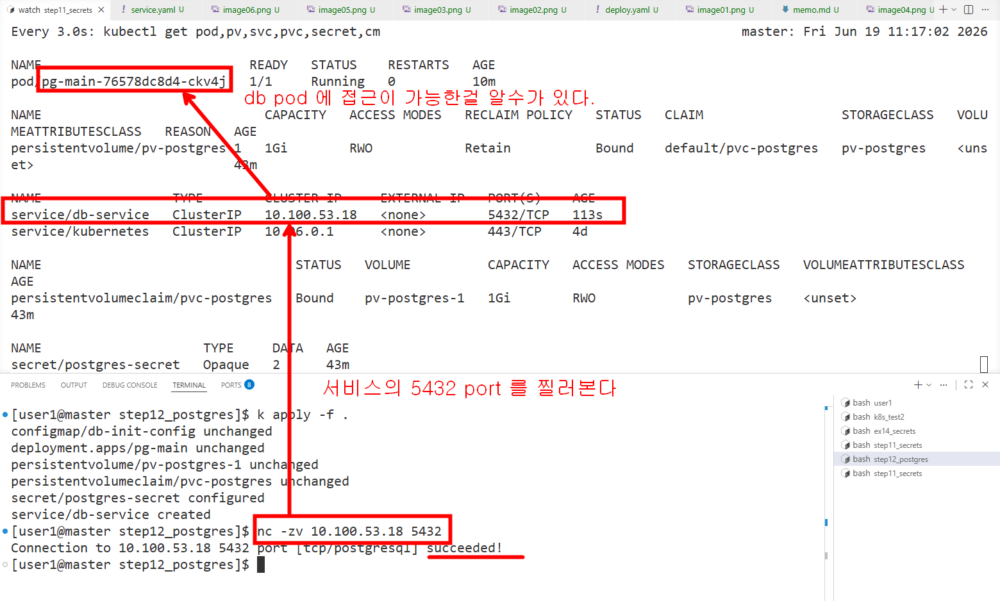

## postgress db pod 만들어 보기 

### nfs 서버에 가서 공유폴더를 미리 생성한다


```bash

k apply -f .


```


### postgres pod 로 진입해서 확인
```bash
k exec -it pg-main-76578dc8d4-ftf5h -- /bin/bash

psql -U scott -d scott_db -h localhost

select * from member;
```



### netcat 을 이용한 테스트



### 서비스를 이용한 postgres 공개



