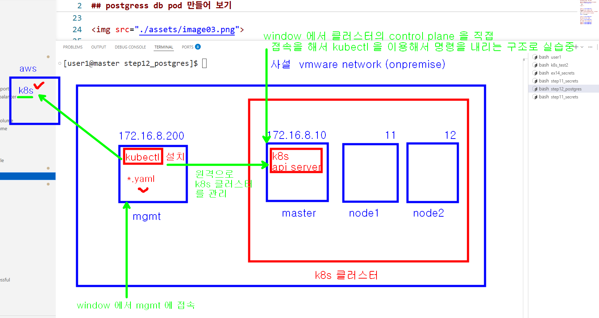

## mgmt 서버에서 kubectl 을 이용해서 master node 를 사용하도록 해보자 



### kubectl 만 설치하기 rocky linux
```bash
# 1. 구글 공식 저장소에서 안정 버전(v1.29) 직접 다운로드
curl -LO "https://dl.k8s.io/release/v1.29.0/bin/linux/amd64/kubectl"

# 2. 다운로드한 파일에 실행(Execute) 권한 부여
chmod +x kubectl

# 3. 시스템 어디서든 명령어를 칠 수 있도록 전역 실행 경로로 이동
sudo mv kubectl /usr/local/bin/

# 4. 설치 정상 완료 확인 (Client Version이 출력되면 성공!)
kubectl version --client
```

### master node 로 부터 /root/.kube/config  파일 가져오기 (mgmt 에서 kubectl 명령어 날릴수 있음)
```bash
# 1. 내 컴퓨터(현재 계정)에 .kube 폴더 생성
mkdir -p $HOME/.kube

# 2. scp로 원격 서버의 통행증을 내 .kube/config 경로로 곧바로 복사
# (실행 후 password: 라는 프롬프트가 뜨면 test123 을 입력하고 엔터!)
scp root@172.16.8.10:/etc/kubernetes/admin.conf $HOME/.kube/config

# 3. 소유권 및 권한 설정 
sudo chown $(id -u):$(id -g) $HOME/.kube/config
chmod 600 $HOME/.kube/config
```
