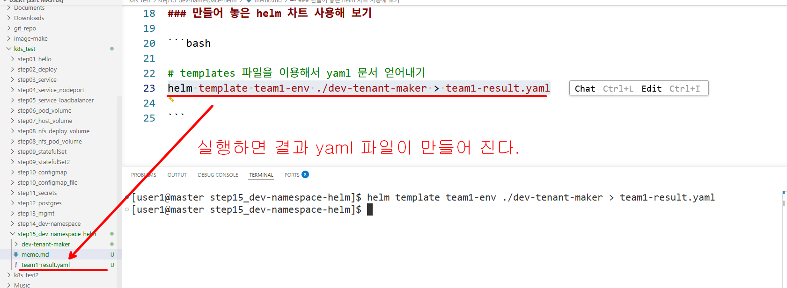
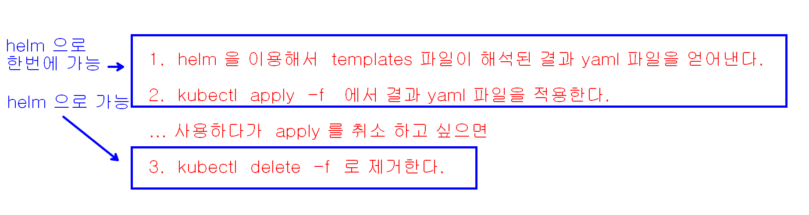

### helm 설치

```bash
# 1. 헬름 공식 GitHub에서 최신 압축 파일 다운로드 
curl -LO https://get.helm.sh/helm-v3.14.2-linux-amd64.tar.gz

# 2. 압축 해제
tar -zxvf helm-v3.14.2-linux-amd64.tar.gz

# 3. 압축 푼 폴더 안에서 'helm' 실행 파일만 골라서 시스템 실행 경로로 이동
sudo mv linux-amd64/helm /usr/local/bin/helm

# 4. 다운로드했던 임시 파일 삭제
rm -rf id linux-amd64 helm-v3.14.2-linux-amd64.tar.gz
```

### 만들어 놓은 helm 차트 사용해 보기

```bash

# templates 파일을 이용해서 yaml 문서 얻어내기
helm template team1-env ./dev-tenant-maker > team1-result.yaml

```





```bash

# templates 를 해석한 결과물을 kubectl apply 까지 해준다. 
helm install team1-env ./dev-tenant-maker
# 혹시 이미 dev namespace 가 존재해서 에러가 발생한다면 해당 namespace 를 삭제한다.
kubectl delete ns dev

# helm 으로 배포한 목록 얻어내기
helm list

# 배포한 앱 삭제(uninstall)
helm uninstall  <배포이름>
helm uninstall team1-env

# 삭제후에 목록 확인
helm list
```