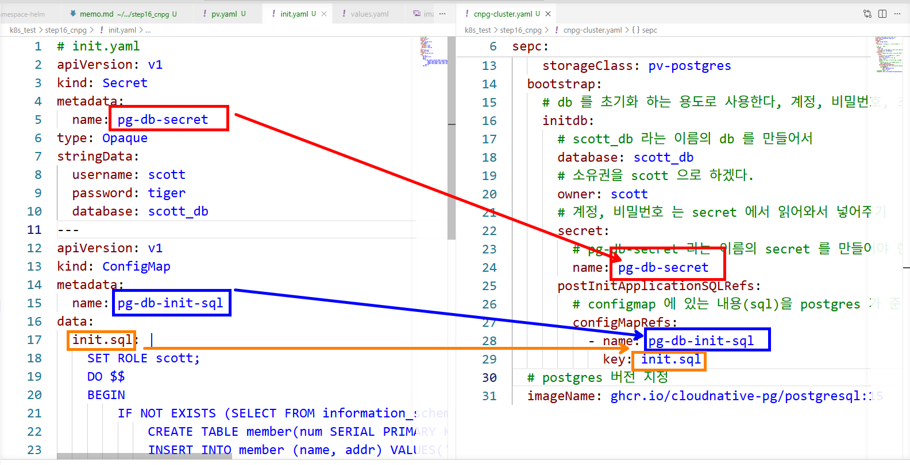
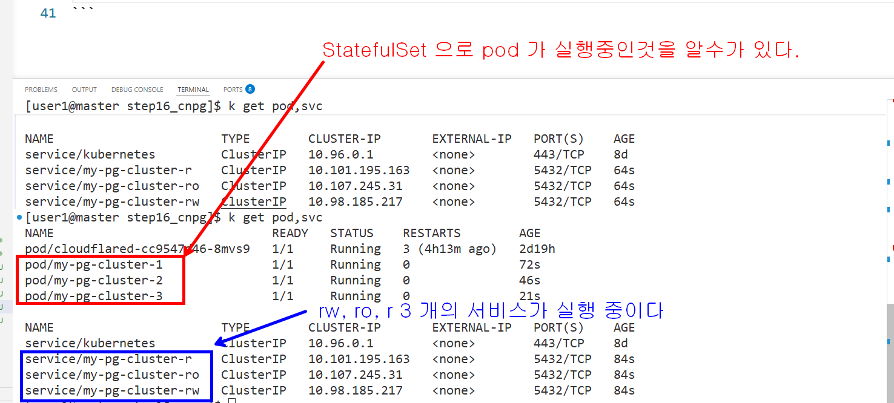
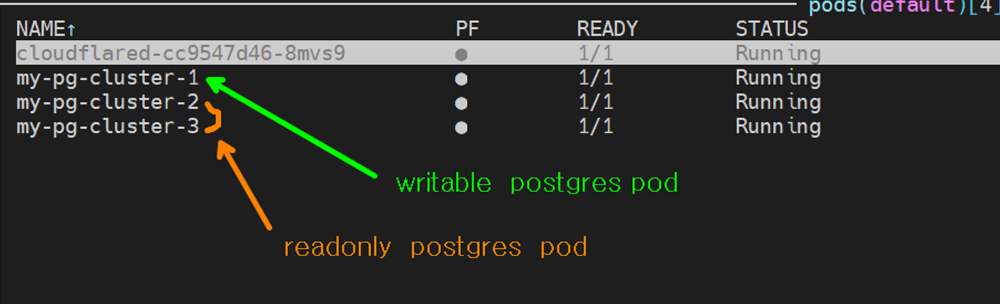
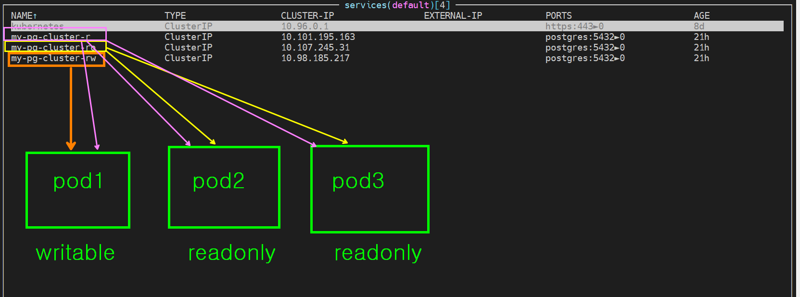
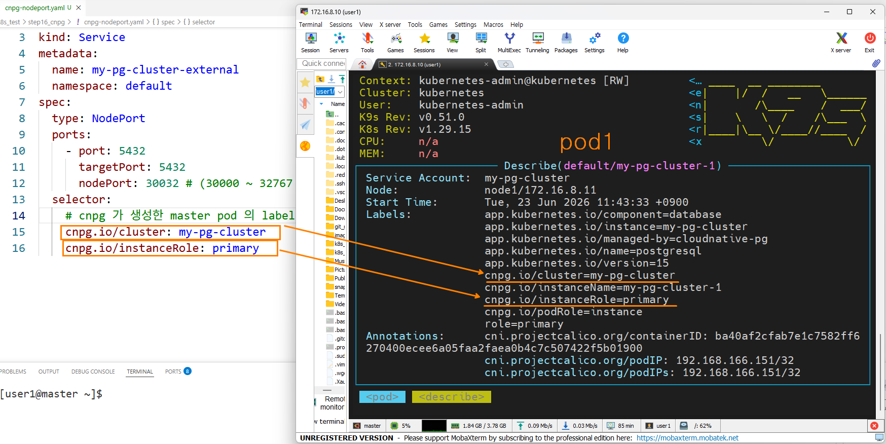
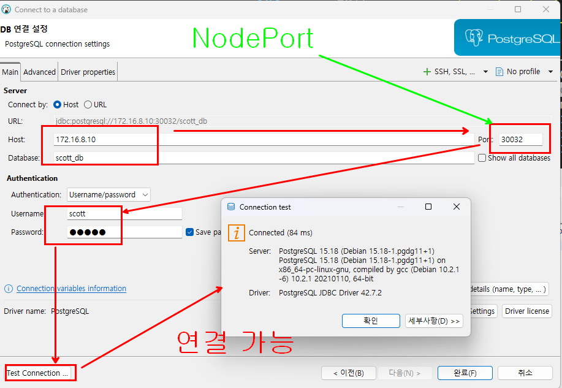

## Cloud Native Postgres 사용해 보기 

### Cloud Native Postgres 를 helm 으로 설치하기

```bash
# 1. CNPG 공식 helm 저장소 추가
# https://cloudnative-pg.github.io/charts 를 가리키는 cnpg 라는 이름의 helm 저장소를 local 에 추가하겠다
helm repo add cnpg https://cloudnative-pg.github.io/charts

# 추가한 저장소에 뭐가 있는지 받아오기(update 하기)
helm repo update

# 저장소 목록 확인하기
helm repo ls

# 설치하기 (Operator 중계자) -> 멱등성 보장 (이미 설치되어 있으면 수정만한다)
helm upgrade --install cnpg --namespace cnpg-system --create-namespace  cnpg/cloudnative-pg

# 아래와 같이 install 할수도 있다. (이미 설치되어 있으면 에러난다)
# helm install cnpg cnpg/cloudnative-pg --namespace cnpg-system --create-namespace

```

### nfs 서버에 공유폴더 준비하기

```bash
./make-nfs.sh pv-postgres-1
./make-nfs.sh pv-postgres-2
./make-nfs.sh pv-postgres-3
```

### cnpg-cluster.yaml 파일과 init.yaml 파일의 관계



### apply 하기

```bash
kubectl apply -f .

# pod, svc 확인
kubectl get pod,svc

```


```bash
# pod 에 접속
kubectl exec -it my-pg-cluster-1 -- /bin/bash
# pod 안에서 실행 -> 비밀번호는 tiger
psql -U scott -d scott_db -h localhost

select * from member;
scott_db=> select * from member;
 num | name | addr  
-----+------+-------
   1 | kim  | seoul
   2 | lee  | pusan
(2 rows)

\q 
exit

### k8s 모니터링 tool  k9s 설치

>~/.kube/config 파일을 이용해서 동작한다

#### ubuntu k9s 설치

```bash
wget https://github.com/derailed/k9s/releases/latest/download/k9s_Linux_amd64.tar.gz
tar -zxvf k9s_Linux_amd64.tar.gz
sudo mv k9s /usr/local/bin/
rm k9s_Linux_amd64.tar.gz LICENSE README.md
k9s
```

#### rocky k9s 설치

```bash
curl -sS -L https://github.com/derailed/k9s/releases/latest/download/k9s_Linux_amd64.tar.gz -o k9s_Linux_amd64.tar.gz
tar -zxvf k9s_Linux_amd64.tar.gz
sudo mv k9s /usr/local/bin/
rm k9s_Linux_amd64.tar.gz LICENSE README.md
```




### NodePort 서비스를 이용해서 외부에서 접속 가능하도록 하기

```bash
kubectl apply -f cnpg-nodeport.yaml
```


