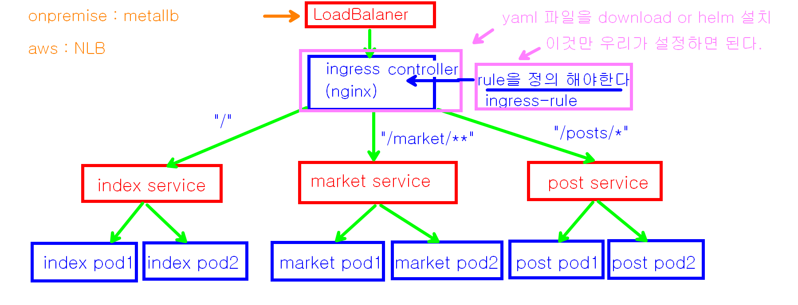
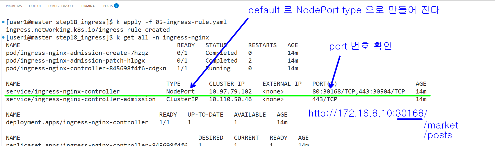

## nginx-ingress-controller 사용해 보기 



```bash

# nginx-ingress-controller 를 배포할수 있는 yaml 파일 다운로드 하기 
# service type 이 default 로 NodePort 로 되어 있다.
# 앞에 LoadBalancer 를 두고 싶으면 service type 을 LoadBalancer 로 수정해서 사용해야 한다.
# 05-ingress-controller.yaml 파일의 365 번째 line 
wget https://raw.githubusercontent.com/kubernetes/ingress-nginx/controller-v1.8.2/deploy/static/provider/baremetal/deploy.yaml

# deploy.yaml 은 인그레스 컨트롤러 역활이므로 파일명 변경
mv deploy.yaml 04-ingress-controller.yaml

```

```bash
# 모두 apply 한후에

# ingress-nginx namespace 의 모든 정보 확인 
k get all -n ingress-nginx
```



