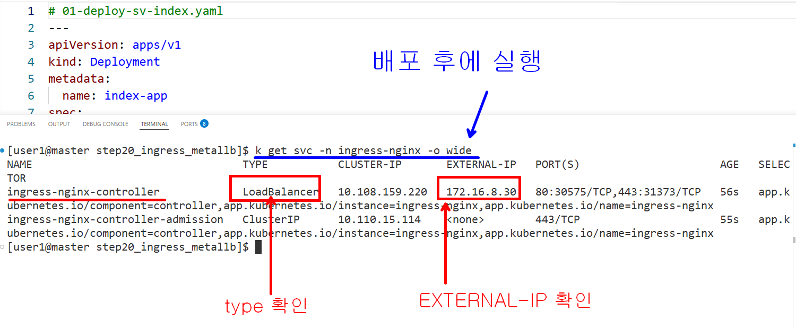
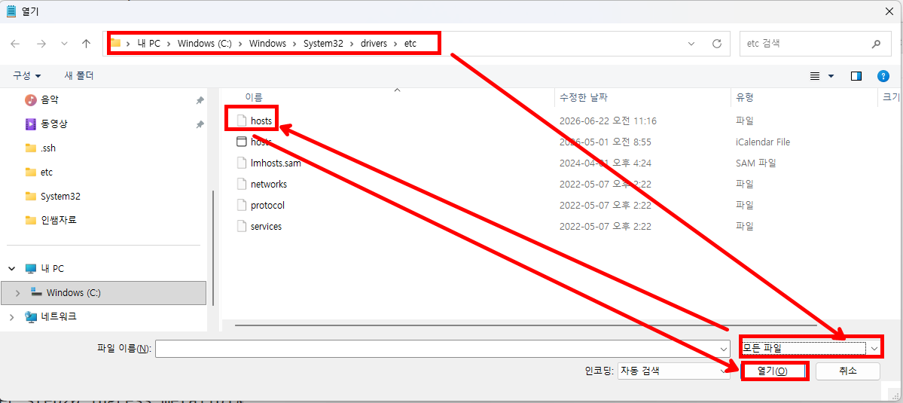

### ingress-controller.yaml 파일의 365 번째 line 수정 

```yaml
  selector:
    app.kubernetes.io/component: controller
    app.kubernetes.io/instance: ingress-nginx
    app.kubernetes.io/name: ingress-nginx
  type: LoadBalancer # Service type 이 default 로 NodePort 이다 
```

### metallb 를 ingress controller 앞에 두기

```bash

# 모두 배포후에 먼저 대문 서비스 간판 조회
kubectl get svc -n ingress-nginx
NAME                                 TYPE           CLUSTER-IP       EXTERNAL-IP   PORT                     
ingress-nginx-controller             LoadBalancer   10.108.159.220   172.16.8.30   80:30575/TCP,443:31373/
ingress-nginx-controller-admission   ClusterIP      10.110.15.114    <none>        443/

```




### 윈도우에서 domain 이름으로 테스트 하기

1. nodepad 를 관리자 권한으로 실행

2. 파일 -> 열기 -> 경로  **C:\Windows\System32\drivers\etc** 

3. 우측하단 파일 형식을 **모든파일** 로 변경해서 hosts 파일 열기

4. 아래의 내용 추가 
```
172.16.8.30  example.com 
```
