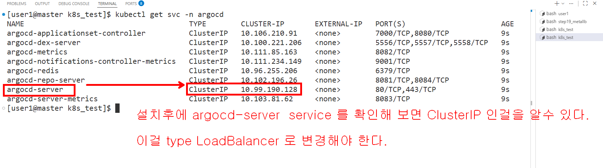
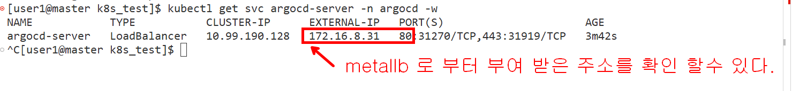
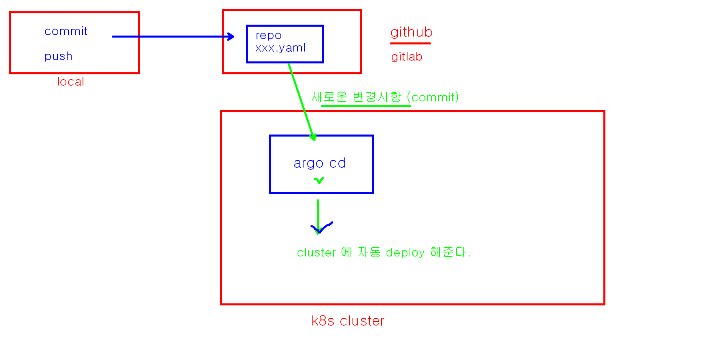
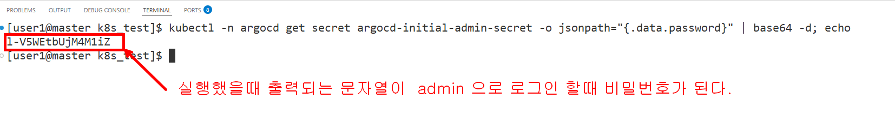

## argocd 설치해서 사용해 보기

```bash
# 1. 아르고 CD 를 위한 네임 스페이스 생성
kubectl create namespace argocd
# 2. 아르고 CD 를 다운받지 않고 즉석에서 바로 설치하기
kubectl apply -n argocd -f https://raw.githubusercontent.com/argoproj/argo-cd/v2.11.0/manifests/install.yaml


# 3. 설치후에 svc 목록 확인
kubectl get svc -n argocd

```


```bash

# 4. 외부 브라우저 접속을 위해 서비스 타입을 LoadBalancer로 패치(변경)합니다.
kubectl patch svc argocd-server -n argocd -p '{"spec": {"type": "LoadBalancer"}}'

# 5. 접속 주소 확인
kubectl get svc argocd-server -n argocd -w
NAME            TYPE           CLUSTER-IP      EXTERNAL-IP   PORT(S)                      AGE
argocd-server   LoadBalancer   10.99.190.128   172.16.8.31   80:31270/TCP,443:31919/TCP   3m42s

```



```bash
# 5. 비밀번호 얻어내기 (계정:admin)
kubectl -n argocd get secret argocd-initial-admin-secret -o jsonpath="{.data.password}" | base64 -d; echo
```



### github 사용할 준비 해 놓기

```bash
# window 의 .ssh 폴더 안에서 예전에 만들어둔 id_ed25519 파일을 ~/.ssh/ 에 넣어둔다

# ~/.ssh/config 파일을 만들어서 아래의 정보를 저장한다
Host github.com
    HostName github.com
    User git
    IdentityFile ~/.ssh/id_ed25519
    StrictHostKeyChecking no

# 권한 조정
chmod 600 id_ed25519
chomd 600 config

# argocd 설치후 삭제하는 방법
kubectl delete -n argocd -f https://raw.githubusercontent.com/argoproj/argo-cd/v2.11.0/manifests/install.yaml

```